

# PhotoPress: Making WordPress Work for Photographers

An integrated suite of image management and presentation features for WordPress that photographers can use to build beautiful photography centric websites.

## The Goal

The goal of PhotoPress is to make WordPress easy and compelling enough for photographers to use it as their primary web publishing platform instead of turning to other proprietary software/platforms. PhotoPress brings a variety of critical image management and presentation features together into a single, modern, and modular plugin. 

Our development motto is "do no harm" which means that we leverage the patterns outlined in WordPress Core and the Gutenberg editor as opposed to creating proprietary features that impede the overall usability of WordPress.

## Features

### Gallery Layouts

Masonry, Rows and Mosaic layouts for the WordPress Gallery block, as block variations:

- Masonry: columns of a width you set, each image at its own height
- Rows: rows of a height you set, each image at its own width
- Mosaic: rows that fill the gallery's width, each image at its own proportions
- They look the same in the editor as on the site
- Open the full-screen slideshow when an image is clicked
- Hide captions option

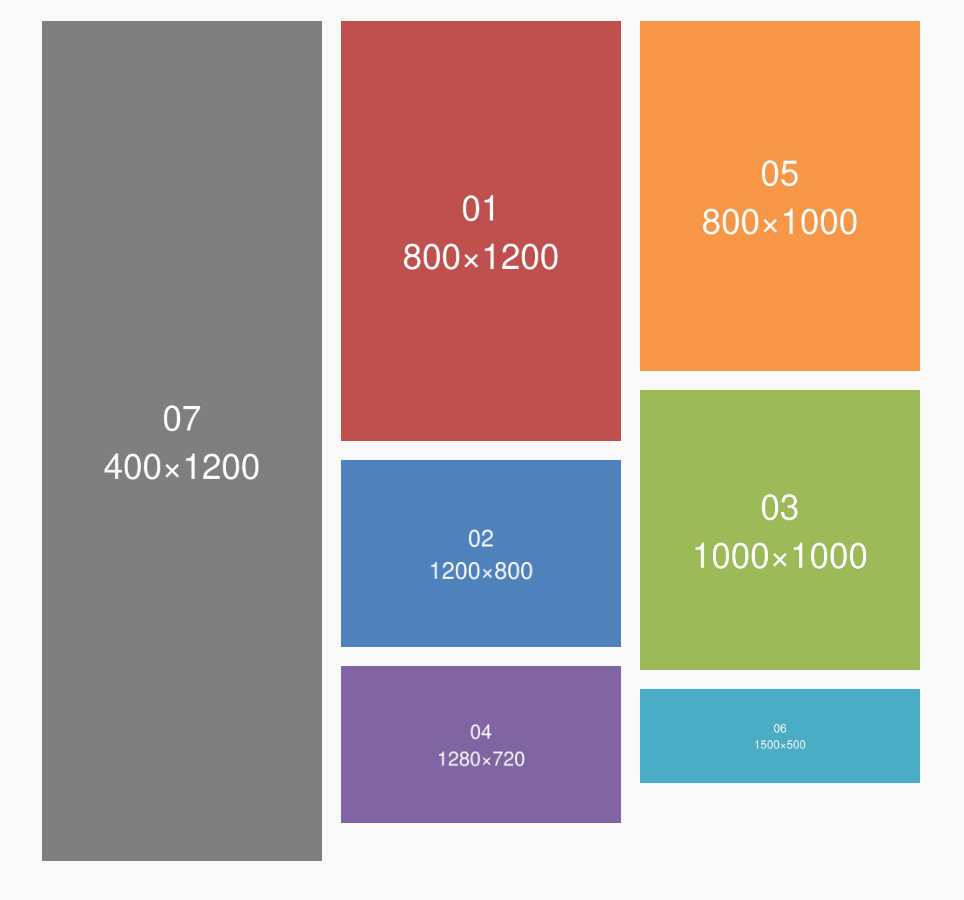

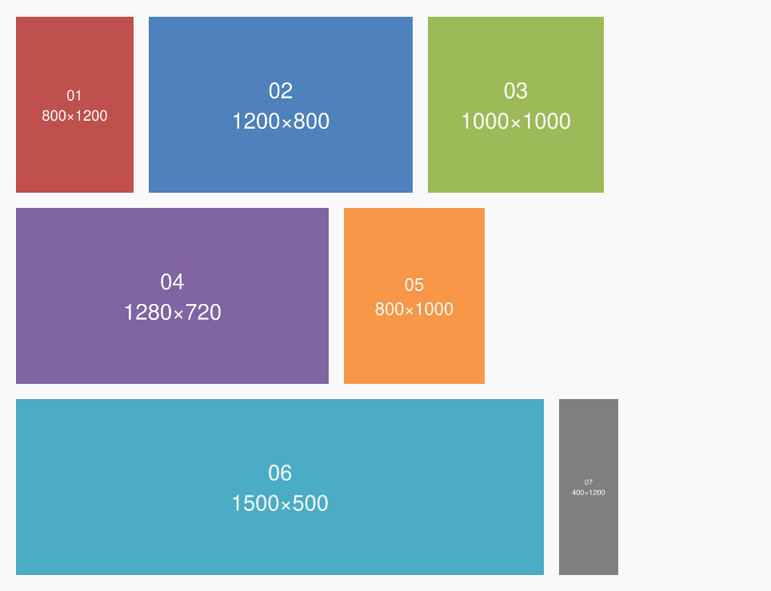

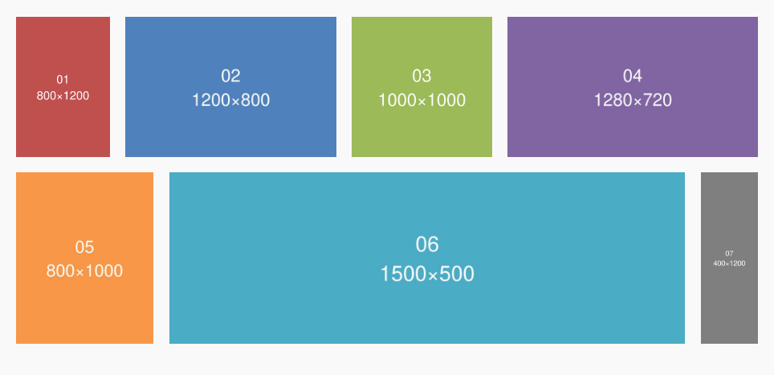

### Full-Screen Slideshow

- Opens over the whole window on the image that was clicked
- Click the right half for the next image, the left half for the previous one; the arrow keys work too
- Thumbnail navigation option, with adjustable height
- Configurable caption display (image title, caption and/or description, and a link to the attachment page)
- Caption box below or to the right of the image, with adjustable padding

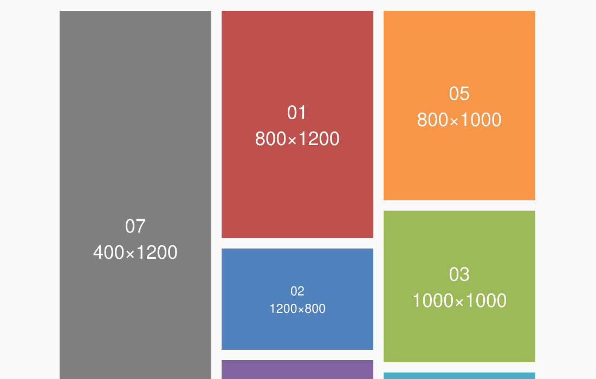

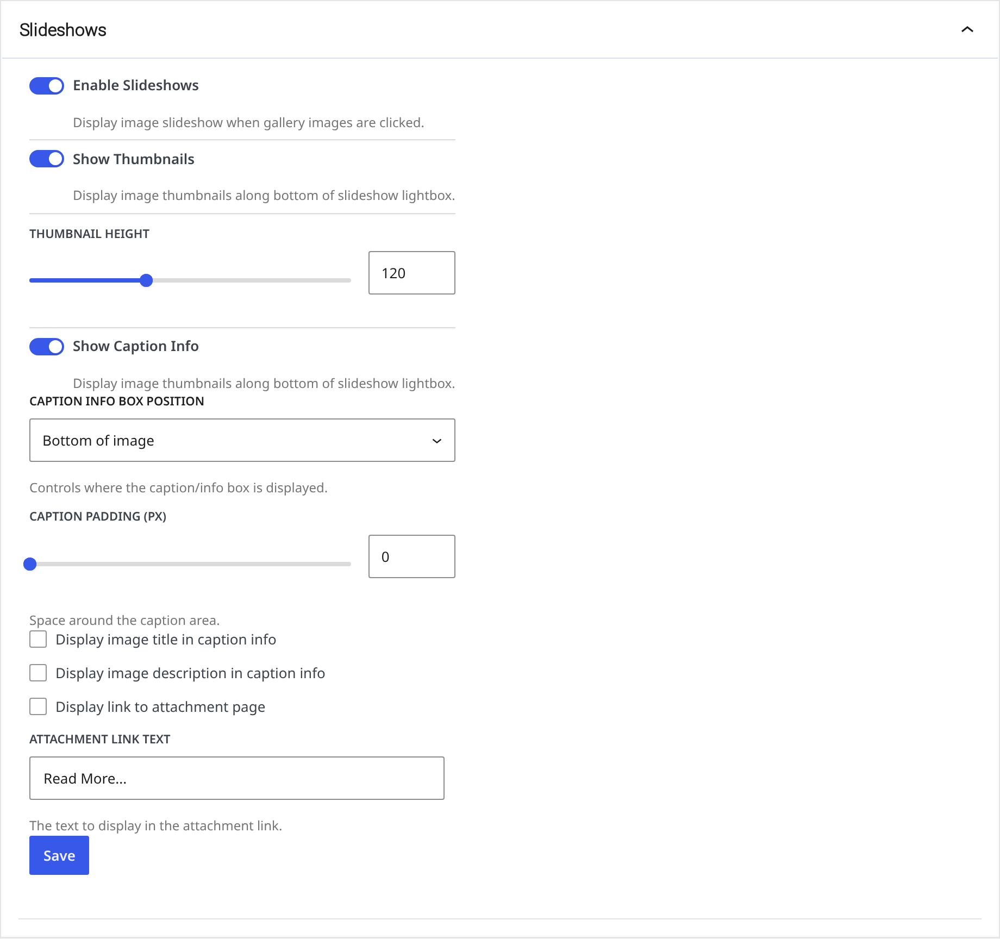

### Gallery Slideshow Block

- A slideshow of a gallery on the same page, placed anywhere on the page
- Clicking an image in the gallery shows it in the slideshow
- Press the right side of the slideshow for the next image, the left side for the previous one
- Slide or fade transitions, and autoplay
- Fits the window's height, less an offset you set
- Captions below, left or right of the image, with adjustable padding
- Caption max width, a share of the slideshow's width (75% by default) that keeps the full width on phones
- Option to hide the gallery and show only the slideshow
- Works with dynamic galleries (WordPress 7.1)

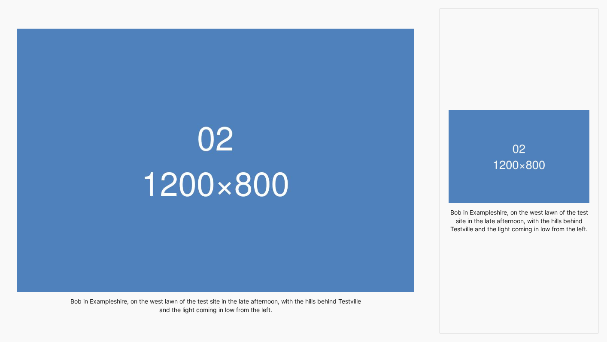

### Child Pages Block

- Dynamic Gutenberg Block
- Create a gallery of child pages, from their featured images (useful as an index of gallery pages)

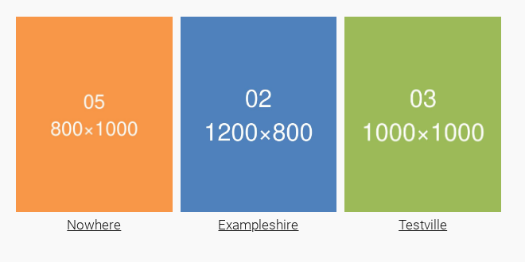

### Meta-Data

- Image taxonomies filled from each photo's embedded EXIF, IPTC and XMP metadata on upload
- Standard Metadata: camera, lens, city, state, country and keywords, read from wherever cameras and photo software record them, with camera names cleaned up and keyword hierarchies kept as nested terms
- Hierarchical Keyword Metadata: keywords under a parent keyword (People › Jane in Lightroom or Capture One, or people: Jane) go to the parent keyword's own taxonomy, each level nested under the one above
- Custom Metadata: any other metadata field as a taxonomy
- Image Taxonomies block: an image's terms, such as keywords, people, places and camera, for block themes
- Display Exif Widget
- Display Image Taxonomy Terms Widget
- Generate custom image ALT text using meta-data templates
- Generate image descriptions using meta-data templates, and reprocess the alt text or descriptions of every image after changing a template
- Licensing metadata (Licensor, Licensor URL, Web Statement of Rights): embedded into image files on upload, or into every image already uploaded, and added as structured data (JSON-LD) to the pages that show them, with any theme
- Re-read the meta-data of every image in the background, with its progress on the settings page, after changing taxonomies or templates

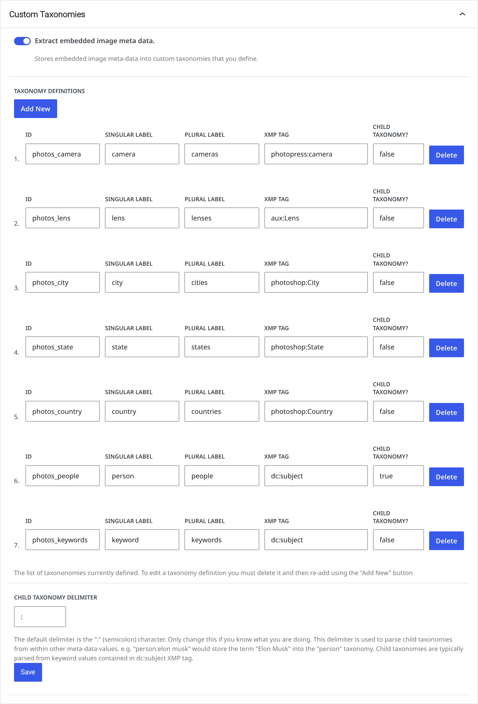

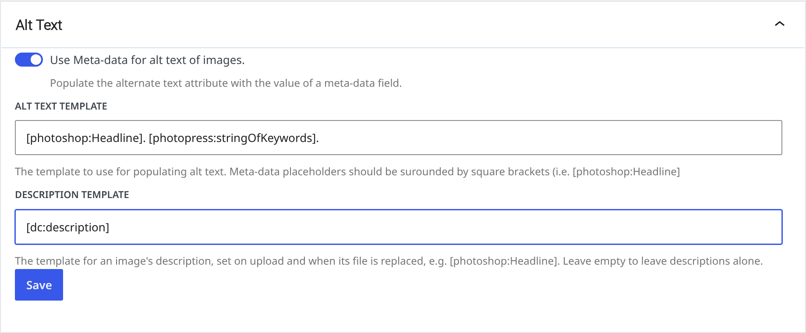

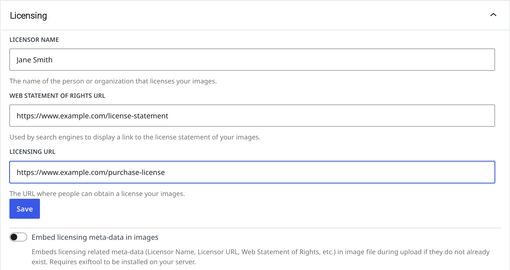

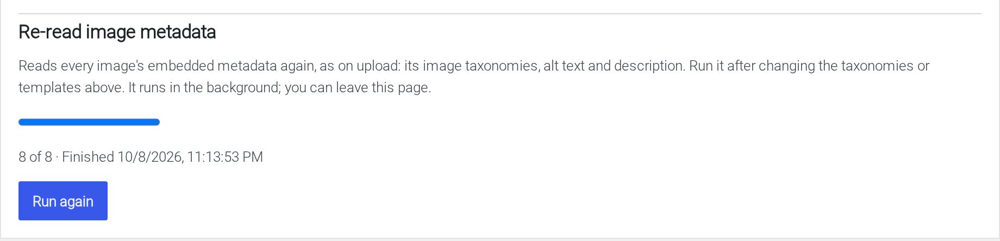

### Offload Media

With [WP Offload Media](https://wordpress.org/plugins/amazon-s3-and-cloudfront/) installed, the Offload Media settings tab shows:

- Whether Offload Media is active, and where images are stored and served from
- How long browsers and the CDN keep offloaded images (by default 1 day, then 1 hour while checking for a new one)
- A button to clear the CloudFront cache

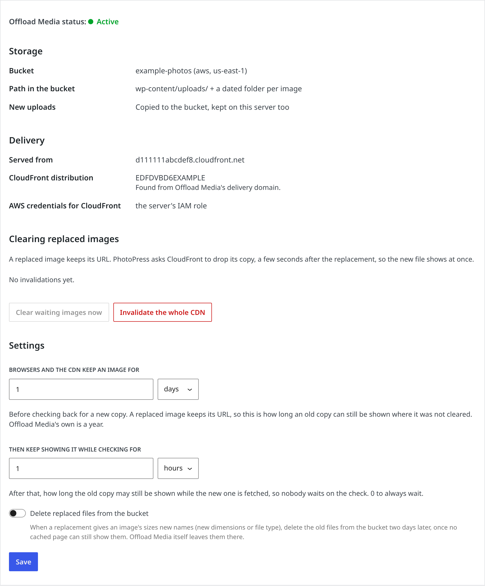

## Requirements

* WordPress 6.6
* PHP 7.0+

The plugin is coded to work on PHP 5.6+, but only 7.0+ is officially supported.

## Installation

The latest release of PhotoPress can be installed from the [WordPress plugin repository](https://wordpress.org/plugins/photopress/). 

## Development 

To contribute to PhotoPress you need to:

1. Clone the repository
2. Download and install [Composer](https://getcomposer.org/) for managing PHP dependencies.
3. Run `composer install`
4. Install [Node.js](https://nodejs.org/) 22 or later
5. Run `npm install`, then `npm run build` (or `npm start` to rebuild as you edit)

## Documentation

Documentation for PhotoPress is maintained on the [wiki](https://github.com/photopress-dev/photopress-plugin/wiki).  Please feel free to add to the wiki if you use the plugin.

## Copyright and License

This project is licensed under the [GNU GPL](http://www.gnu.org/licenses/old-licenses/gpl-2.0.html), version 2 or later.

2011&thinsp;&ndash;&thinsp;2020 &copy; [Peter Adams](http://peteradams.org).
